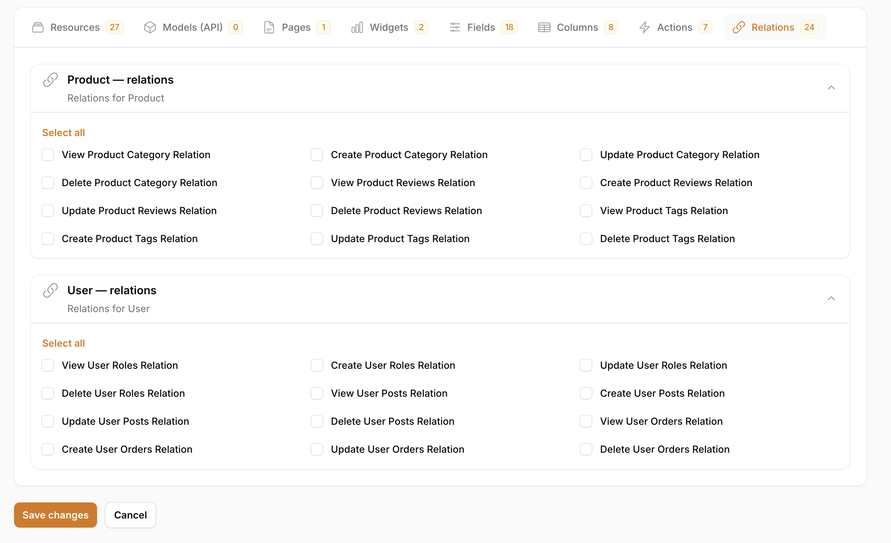

<div align="center">


<br><br>

[](https://packagist.org/packages/laraarabdev/filament-gatekeeper)
[](https://packagist.org/packages/laraarabdev/filament-gatekeeper)
[](https://packagist.org/packages/laraarabdev/filament-gatekeeper)
[](https://codecov.io/gh/laraarabdev/filament-gatekeeper)
[](https://php.net)
[](https://laravel.com)
[](https://filamentphp.com)

**Advanced Role and Permission management for Laravel Filament 3.x with Spatie Permission integration.**

<br>



</div>

---

## Stop Wrestling With Permissions. Take Full Control.

Building a Filament admin panel is fast — until you need to control **who sees what**.

Suddenly you're writing `canViewAny()` overrides in every resource, scattering `hasPermissionTo()` calls across controllers, manually maintaining permission lists in seeders, and praying nothing gets out of sync when you add a new model.

**Filament Gatekeeper ends all of that.**

One package gives you complete, consistent access control across your **entire** Laravel application — the Filament panel, your REST API, and everything in between — driven by a single source of truth.

---

### The Problem Every Filament Developer Faces

> *"I need to control access to resources, individual table columns, form fields, custom actions, widgets, pages, and API routes — but Filament doesn't give me a unified way to do it."*

Most teams end up with a patchwork of:
- ❌ Hard-coded role checks scattered across dozens of files
- ❌ Permissions defined in seeders that don't match what the UI actually shows
- ❌ API routes and Filament panels with completely separate permission logic
- ❌ No way to grant access to a single field without exposing everything else
- ❌ Hours wasted every time a new model or resource is added

---

### The Gatekeeper Solution

Filament Gatekeeper introduces a **structured permission model** that maps directly to what your UI actually does — and syncs it automatically.

```bash
php artisan gatekeeper:sync
```

That one command discovers all your resources, pages, widgets, fields, columns, and relations — then creates every permission you need in the database. No manual work. No drift. No surprises.

**Then assign them in the UI:**

- Give `editor` the ability to view the `salary` column but not edit it
- Allow `support` to view users but never delete them
- Let `manager` access the Reports page but hide the Finance widget
- Expose only the `email` field in your API response for users without the right role

All without touching a single line of application code.

---

### Why Developers Choose Gatekeeper

| Without Gatekeeper | With Gatekeeper |
|---|---|
| Permission logic spread across every file | One config, one sync command |
| Filament panel and API have separate auth | Unified permission model everywhere |
| Adding a model means updating 5+ places | Auto-discovered and synced automatically |
| No field or column-level access control | Granular control down to a single field |
| Super admin needs special-casing everywhere | One role, bypasses everything |
| Permission lists go stale over time | `gatekeeper:sync` keeps them fresh |

---


## Table of Contents

- [Features](#features)
- [Requirements](#requirements)
- [Installation](#installation)
- [Quick Start](#quick-start)
- [Configuration](#configuration)
- [Default Setup Options](#default-setup-options)
- [Usage](#usage)
- [Auto-Discovery](#auto-discovery)
- [Permission Management](#permission-management)
- [API Permissions](#api-permissions)
- [Commands](#commands)
- [Quick Reference](#quick-reference)
- [Contributing](#contributing)
- [License](#license)

---

## Features

### Filament Admin Panel

| Feature | Description |
|---|---|
| **Resource Permissions** | Full CRUD + restore, force delete, replicate, reorder |
| **Field Permissions** | Control form field visibility and editability |
| **Column Permissions** | Control table column visibility |
| **Action Permissions** | Control custom action execution |
| **Page Permissions** | Control page access |
| **Widget Permissions** | Control widget visibility |
| **Relation Permissions** | Control relation manager access |

### API & Backend

| Feature | Description |
|---|---|
| **API Middleware** | Route-level permission checking |
| **Controller Traits** | Easy permission checks in controllers |
| **API Resource Permissions** | Field/relation visibility in JSON responses |
| **Model Permissions** | Permissions for models without Filament resources |

### System Features

| Feature | Description |
|---|---|
| **Super Admin Bypass** | Configurable super admin role that bypasses all checks |
| **Multi-Guard Support** | Web, API, and custom guards with auto-detection |
| **HMVC Module Support** | Works with `nwidart/laravel-modules` |
| **Performance Caching** | Cached permission matrix for fast lookups |
| **Localization** | English and Arabic out of the box |

---

## Requirements

- **PHP** 8.2+
- **Laravel** 10.x, 11.x, or 12.x
- **Filament** 3.x
- **Spatie Laravel Permission** 6.x _(must be installed and configured)_

---

## Installation

### Step 1: Install Spatie Laravel Permission

```bash
composer require spatie/laravel-permission
```

Publish and run migrations:

```bash
php artisan vendor:publish --provider="Spatie\Permission\PermissionServiceProvider"
php artisan migrate
```

### Step 2: Install Filament Gatekeeper

```bash
composer require laraarabdev/filament-gatekeeper
```

### Step 3: Publish Configuration

```bash
php artisan vendor:publish --tag=gatekeeper-config
```

### Step 4: Publish and Run Migrations

```bash
php artisan vendor:publish --tag=gatekeeper-migrations
php artisan migrate
```

### Step 5: Update Permission Config

Update your `config/permission.php` to use Gatekeeper's models:

```php
'models' => [
    'permission' => LaraArabDev\FilamentGatekeeper\Models\Permission::class,
    'role' => LaraArabDev\FilamentGatekeeper\Models\Role::class,
],
```

### Step 6 (Optional): Publish Stubs for Resources, Pages & Widgets

To have Filament's `make` commands generate Gatekeeper-aware classes, publish the stubs:

```bash
php artisan vendor:publish --tag=gatekeeper-stubs
```

Then use `make:filament-resource`, `make:filament-page`, and `make:filament-widget` as usual — they will use the published stubs from `stubs/filament/`.

### Alternative: Use the Install Command

Run the install command which handles all steps automatically:

```bash
php artisan gatekeeper:install
```

---

## Quick Start

### 1. Register the Plugin

In your Filament Panel Provider (`app/Providers/Filament/AdminPanelProvider.php`):

```php
use LaraArabDev\FilamentGatekeeper\GatekeeperPlugin;

public function panel(Panel $panel): Panel
{
    return $panel
        ->plugins([
            GatekeeperPlugin::make()
                ->superAdminRole('super-admin')
                ->bypassForSuperAdmin(true)
                ->enableFieldPermissions()
                ->enableColumnPermissions()
                ->enableActionPermissions()
                ->enableRelationPermissions()
                ->navigationGroup('Access Control'),
        ]);
}
```

### 2. Add HasRoles to User Model

**Option A: Extend Base Class (Recommended)**

```php
use LaraArabDev\FilamentGatekeeper\Base\GatekeeperAuthenticatable;

class User extends GatekeeperAuthenticatable
{
    // HasRoles trait is automatically included!
}
```

**Option B: Use Trait Manually**

```php
use Illuminate\Foundation\Auth\User as Authenticatable;
use Spatie\Permission\Traits\HasRoles;

class User extends Authenticatable
{
    use HasRoles;
}
```

### 3. Apply Permissions to Resources

**Option A: Extend Base Class (Recommended)**

```php
use LaraArabDev\FilamentGatekeeper\Base\GatekeeperResource;

class UserResource extends GatekeeperResource
{
    protected static ?string $model = User::class;
    // All permissions work automatically!
}
```

**Option B: Use Traits**

```php
use Filament\Resources\Resource;
use LaraArabDev\FilamentGatekeeper\Concerns\HasResourcePermissions;

class UserResource extends Resource
{
    use HasResourcePermissions;

    protected static ?string $model = User::class;
}
```

### 4. Sync Permissions

```bash
php artisan gatekeeper:sync
```

Or use the dashboard action in the Role Resource.

### 5. Assign Roles to Users

Navigate to the **Roles** page in your Filament panel, assign permissions to roles, then assign roles to users.

---

## Configuration

The configuration file is located at `config/gatekeeper.php`. Key settings:

```php
return [
    'super_admin' => [
        'enabled' => true,
        'role' => 'super-admin',
    ],

    'guards' => [
        'web' => ['enabled' => true],
        'api' => ['enabled' => true],
    ],

    'field_permissions' => [
        'User' => ['email', 'password', 'salary', 'phone'],
    ],

    'column_permissions' => [
        'User' => ['email', 'phone', 'salary', 'created_at'],
    ],

    'custom_actions' => [
        'User' => ['export', 'impersonate', 'suspend'],
    ],

    'relation_permissions' => [
        'User' => ['roles', 'posts', 'orders'],
    ],

    'field_discovery' => [
        'enabled' => true,
        'sources' => ['config', 'fillable'],
    ],

    'column_discovery' => [
        'enabled' => true,
        'sources' => ['config', 'database'],
    ],
];
```

---

## Default Setup Options

All options are in `config/gatekeeper.php`. Below is a complete reference of every available setting.

### Super Admin

| Key | Default | Description |
|---|---|---|
| `super_admin.enabled` | `true` | Enable super admin bypass for all permission checks |
| `super_admin.role` | `'super-admin'` | Role name that bypasses all checks |

### Guards

| Key | Default | Options | Description |
|---|---|---|---|
| `guard` | `'web'` | `'web'`, `'api'`, any guard name | Default guard used for permission checks |
| `guards.web.enabled` | `true` | `true`, `false` | Enable web guard |
| `guards.web.provider` | `'users'` | Any auth provider | User provider for web guard |
| `guards.api.enabled` | `true` | `true`, `false` | Enable API guard |
| `guards.api.provider` | `'users'` | Any auth provider | User provider for API guard |

### Discovery Paths

| Key | Default | Description |
|---|---|---|
| `discovery.discover_models` | `false` | Auto-discover API-only models (no Filament resource) |
| `discovery.models` | `['app/Models']` | Paths to scan for models |
| `discovery.resources` | `['app/Filament/Resources', 'app/Filament/*/Resources']` | Paths to scan for Filament resources |
| `discovery.pages` | `['app/Filament/Pages', 'app/Filament/*/Pages']` | Paths to scan for Filament pages |
| `discovery.widgets` | `['app/Filament/Widgets', 'app/Filament/*/Widgets']` | Paths to scan for Filament widgets |

### Field Discovery

| Key | Default | Options | Description |
|---|---|---|---|
| `field_discovery.enabled` | `false` | `true`, `false` | Auto-detect fields for permission generation |
| `field_discovery.sources` | `['config', 'fillable']` | `config`, `fillable`, `database`, `resource` | Sources checked in order; first match per model wins |
| `field_discovery.default_excluded` | `['id', 'uuid', 'created_at', ...]` | Array of field names | Fields always excluded from all models |
| `field_discovery.excluded.*` | `['password']` | Array of field names | Fields excluded from every model |
| `field_discovery.excluded.ModelName` | `[]` | Array of field names | Fields excluded from a specific model |
| `field_discovery.sensitive_patterns` | `['password', 'secret', 'token', ...]` | Array of patterns | Patterns flagged as sensitive (for reporting) |

**Field discovery sources:**

| Source | Best For |
|---|---|
| `config` | Manual control — reads from `field_permissions` array |
| `fillable` | Auto-detect from model `$fillable` **(Recommended)** |
| `database` | Full schema coverage — all DB columns |
| `resource` | Match Filament `form()` field definitions |

### Column Discovery

| Key | Default | Options | Description |
|---|---|---|---|
| `column_discovery.enabled` | `false` | `true`, `false` | Auto-detect columns for permission generation |
| `column_discovery.sources` | `['config', 'database']` | `config`, `database`, `resource` | Sources checked in order; first match per model wins |
| `column_discovery.default_excluded` | `['password', 'remember_token', ...]` | Array of column names | Columns always excluded from all models |
| `column_discovery.excluded.*` | `[]` | Array of column names | Columns excluded from every model |
| `column_discovery.excluded.ModelName` | `[]` | Array of column names | Columns excluded from a specific model |
| `column_discovery.sensitive_patterns` | `['password', 'secret', 'salary', ...]` | Array of patterns | Patterns flagged as sensitive (for reporting) |

**Column discovery sources:**

| Source | Best For |
|---|---|
| `config` | Manual control — reads from `column_permissions` array |
| `database` | Full schema coverage — all DB columns **(Recommended)** |
| `resource` | Match Filament `table()` column definitions |

### HMVC Modules (nwidart/laravel-modules)

| Key | Default | Description |
|---|---|---|
| `modules.enabled` | `false` | Enable module discovery |
| `modules.namespace` | `'Modules'` | Root namespace for modules |
| `modules.path` | `base_path('Modules')` | Root path for modules |
| `modules.discovery_paths.models` | `'{module}/Models'` | Model path pattern inside each module |
| `modules.discovery_paths.resources` | `'{module}/Filament/Resources'` | Resource path pattern |
| `modules.discovery_paths.pages` | `'{module}/Filament/Pages'` | Page path pattern |
| `modules.discovery_paths.widgets` | `'{module}/Filament/Widgets'` | Widget path pattern |

### Navigation

| Key | Default | Description |
|---|---|---|
| `navigation.group` | `'Access Control'` | Sidebar group for Gatekeeper resources |
| `navigation.icon` | `'heroicon-o-shield-check'` | Icon for navigation items |
| `navigation.sort` | `1` | Sort order within the navigation group |

### Cache

| Key | Default | Description |
|---|---|---|
| `cache.enabled` | `true` | Enable permission caching |
| `cache.driver` | `null` | Cache driver (`null` = default app driver) |
| `cache.prefix` | `'gatekeeper'` | Cache key prefix |
| `cache.ttl` | `3600` | Cache TTL in seconds (1 hour) |
| `cache.tags` | `['gatekeeper']` | Cache tags (requires tagged driver like Redis) |

### Permission Generator

| Key | Default | Options | Description |
|---|---|---|---|
| `generator.snake_case` | `true` | `true`, `false` | Use snake_case names (`view_any_user` vs `viewAnyUser`) |
| `generator.separator` | `'_'` | Any string | Separator between permission parts |
| `generator.include_guard` | `false` | `true`, `false` | Append guard name to permission (e.g. `view_any_user_web`) |

### Exclusion Lists

| Key | Default | Description |
|---|---|---|
| `excluded_models` | `[]` | Models to skip during permission discovery |
| `excluded_resources` | `[]` | Filament resources to skip |
| `excluded_pages` | `[]` | Filament pages to skip |
| `excluded_widgets` | `[]` | Filament widgets to skip |

---

## Usage

### Resource Permissions

When using `HasResourcePermissions` trait or extending `GatekeeperResource`, these methods are automatically implemented:

| Method | Description |
|---|---|
| `canViewAny()` | Check if user can view any records |
| `canView($record)` | Check if user can view a specific record |
| `canCreate()` | Check if user can create records |
| `canEdit($record)` | Check if user can edit a record |
| `canDelete($record)` | Check if user can delete a record |
| `canRestore($record)` | Check if user can restore a record |
| `canForceDelete($record)` | Check if user can force delete a record |
| `canReplicate($record)` | Check if user can replicate a record |
| `canReorder()` | Check if user can reorder records |

**Generated permissions:** `view_any_user`, `view_user`, `create_user`, `update_user`, `delete_user`, `restore_user`, `force_delete_user`, `replicate_user`, `reorder_user`

### Field Permissions

Control visibility and editability of form fields:

```php
use LaraArabDev\FilamentGatekeeper\Concerns\HasFieldPermissions;

class UserResource extends Resource
{
    use HasFieldPermissions;

    public static function form(Form $form): Form
    {
        return $form->schema([
            TextInput::make('name'),

            TextInput::make('email')
                ->visible(fn () => static::canViewField('email'))
                ->disabled(fn () => !static::canUpdateField('email')),

            TextInput::make('salary')
                ->visible(fn () => static::canViewField('salary'))
                ->disabled(fn () => !static::canUpdateField('salary')),
        ]);
    }
}
```

**Generated permissions:** `view_field_user_email`, `update_field_user_email`, `view_field_user_salary`, `update_field_user_salary`

### Column Permissions

Control table column visibility:

```php
use LaraArabDev\FilamentGatekeeper\Concerns\HasColumnPermissions;

class UserResource extends Resource
{
    use HasColumnPermissions;

    public static function table(Table $table): Table
    {
        return $table->columns([
            TextColumn::make('name'),

            TextColumn::make('email')
                ->visible(fn () => static::canViewColumn('email')),

            TextColumn::make('salary')
                ->visible(fn () => static::canViewColumn('salary')),
        ]);
    }
}
```

**Generated permissions:** `view_column_user_email`, `view_column_user_salary`

### Action Permissions

Control custom action execution:

```php
use LaraArabDev\FilamentGatekeeper\Concerns\HasActionPermissions;

class UserResource extends Resource
{
    use HasActionPermissions;

    public static function table(Table $table): Table
    {
        return $table->actions([
            Action::make('export')
                ->visible(fn () => static::canExecuteAction('export')),
        ]);
    }
}
```

**Generated permissions:** `execute_user_export_action`

### Page Permissions

Control access to custom Filament pages:

```php
use LaraArabDev\FilamentGatekeeper\Base\GatekeeperPage;

class SettingsPage extends GatekeeperPage
{
    protected static string $view = 'filament.pages.settings';
    // canAccess() works automatically
}
```

**Generated permissions:** `view_settings_page`

### Widget Permissions

Control widget visibility:

```php
use LaraArabDev\FilamentGatekeeper\Base\GatekeeperWidget;

class StatsOverview extends GatekeeperWidget
{
    // canView() works automatically
}
```

**Generated permissions:** `view_stats_overview_widget`

### Relation Permissions

Control access to relation managers:

```php
use LaraArabDev\FilamentGatekeeper\Concerns\HasRelationPermissions;

class UserResource extends Resource
{
    use HasRelationPermissions;

    public static function getRelations(): array
    {
        return static::getPermittedRelations([
            RolesRelationManager::class,
            PostsRelationManager::class,
        ]);
    }
}
```

**Generated permissions:** `view_relation_user_roles`, `view_relation_user_posts`

---

## Auto-Discovery

Filament Gatekeeper can automatically discover fields and columns from your models, database schema, or Filament resources.

### Field Discovery

```php
'field_discovery' => [
    'enabled' => true,
    'sources' => ['config', 'fillable'],  // Recommended default
],
```

| Source | Best For |
|---|---|
| `config` | Read from `field_permissions` array |
| `fillable` | Read from model's `$fillable` property **(Recommended)** |
| `database` | Read all columns from database schema |
| `resource` | Parse from Filament Resource `form()` method |

### Column Discovery

```php
'column_discovery' => [
    'enabled' => true,
    'sources' => ['config', 'database'],  // Recommended default
],
```

| Source | Best For |
|---|---|
| `config` | Read from `column_permissions` array |
| `database` | Read all columns from database schema **(Recommended)** |
| `resource` | Parse from Filament Resource `table()` method |

---

## Permission Management

### Delete Permissions

```bash
# Delete field permissions
php artisan gatekeeper:delete --type=field --model=User --force

# Delete column permissions
php artisan gatekeeper:delete --type=column --model=User --force

# Delete all model permissions
php artisan gatekeeper:delete --type=model --model=User --force

# Delete orphaned permissions
php artisan gatekeeper:delete --type=orphaned --force
```

### Sync Permissions

```bash
# Sync all permissions
php artisan gatekeeper:sync

# Sync specific type only
php artisan gatekeeper:sync --only=resources
php artisan gatekeeper:sync --only=fields
php artisan gatekeeper:sync --only=columns
```

---

## API Permissions

### Middleware

**Single permission check:**

```php
Route::middleware(['auth:sanctum', 'gatekeeper.api:view_any_user'])->group(function () {
    Route::get('/users', [UserController::class, 'index']);
});
```

**Auto CRUD permissions:**

```php
Route::middleware(['auth:sanctum', 'gatekeeper.resource:user'])->group(function () {
    Route::apiResource('users', UserController::class);
});
// Automatically checks: view_any_user, create_user, view_user, update_user, delete_user
```

Register middleware in `bootstrap/app.php` (Laravel 11+):

```php
->withMiddleware(function (Middleware $middleware) {
    $middleware->alias([
        'gatekeeper.api'      => \LaraArabDev\FilamentGatekeeper\Http\Middleware\GatekeeperApiMiddleware::class,
        'gatekeeper.resource' => \LaraArabDev\FilamentGatekeeper\Http\Middleware\GatekeeperResourceMiddleware::class,
    ]);
})
```

### Controller Permissions

There are four ways to handle permissions in controllers — choose the approach that fits your needs.

---

#### Option 1: Route-Level Middleware (Recommended)

Zero controller code — apply `gatekeeper.resource:ModelName` on your `apiResource` route:

```php
Route::apiResource('users', UserController::class)
    ->middleware(['auth:sanctum', 'gatekeeper.resource:User']);
```

**Auto-mapping:**

| HTTP Method | URL | Permission Checked |
|---|---|---|
| `GET` | `/users` | `view_any_user` |
| `GET` | `/users/{id}` | `view_user` |
| `POST` | `/users` | `create_user` |
| `PUT` / `PATCH` | `/users/{id}` | `update_user` |
| `DELETE` | `/users/{id}` | `delete_user` |

Your controller stays completely clean:

```php
class UserController extends Controller
{
    public function index()  { return User::paginate(); }
    public function store(Request $request) { return User::create($request->validated()); }
    public function show(User $user) { return $user; }
    public function update(Request $request, User $user) { $user->update($request->validated()); return $user; }
    public function destroy(User $user) { $user->delete(); return response()->noContent(); }
}
```

---

#### Option 2: Constructor-Level Middleware

Use `$this->middleware()` in the constructor to apply permissions once for the whole controller:

```php
class UserController extends Controller
{
    public function __construct()
    {
        $this->middleware('gatekeeper.resource:User');

        // Or map specific methods manually
        $this->middleware('gatekeeper.api:view_any_user')->only('index');
        $this->middleware('gatekeeper.api:create_user')->only('store');
    }
}
```

---

#### Option 3: Per-Route Middleware

Use `gatekeeper.api:permission` directly on individual routes for custom or non-standard routes:

```php
Route::get('/users/export', [UserController::class, 'export'])
    ->middleware(['auth:sanctum', 'gatekeeper.api:execute_user_export_action']);

Route::post('/users/bulk-delete', [UserController::class, 'bulkDelete'])
    ->middleware(['auth:sanctum', 'gatekeeper.api:delete_user']);
```

---

#### Option 4: Per-Method (Manual Trait)

Use `HasApiPermissions` trait for full control inside each method:

```php
use LaraArabDev\FilamentGatekeeper\Concerns\HasApiPermissions;

class UserController extends Controller
{
    use HasApiPermissions;

    protected string $permissionModel = 'user';

    public function index()
    {
        $this->authorizeIndex();        // view_any_user
        return User::paginate();
    }

    public function store(Request $request)
    {
        $this->authorizeStore();        // create_user
        return User::create($request->validated());
    }

    public function show(User $user)
    {
        $this->authorizeShow($user);    // view_user
        return $user;
    }

    public function update(Request $request, User $user)
    {
        $this->authorizeUpdate($user);  // update_user
        $user->update($request->validated());
        return $user;
    }

    public function destroy(User $user)
    {
        $this->authorizeDestroy($user); // delete_user
        $user->delete();
        return response()->noContent();
    }
}
```

**Available trait methods:**

| Method | Permission Checked |
|---|---|
| `$this->authorizeIndex()` | `view_any_{model}` |
| `$this->authorizeShow($model)` | `view_{model}` |
| `$this->authorizeStore()` | `create_{model}` |
| `$this->authorizeUpdate($model)` | `update_{model}` |
| `$this->authorizeDestroy($model)` | `delete_{model}` |
| `$this->authorizeRestore($model)` | `restore_{model}` |
| `$this->authorizeForceDelete($model)` | `force_delete_{model}` |
| `$this->authorizePermission('custom_perm')` | Any custom permission |
| `$this->canIndex()` | Returns `bool` for `view_any_{model}` |
| `$this->canStore()` | Returns `bool` for `create_{model}` |
| `$this->canPerform('action', $model)` | Returns `bool` for any action |
| `$this->canViewField('field')` | Returns `bool` for field visibility |
| `$this->canUpdateField('field')` | Returns `bool` for field editability |
| `$this->canViewColumn('column')` | Returns `bool` for column visibility |
| `$this->canExecuteAction('action')` | Returns `bool` for custom action |
| `$this->getVisibleFields()` | Returns `array` of allowed fields |
| `$this->getVisibleColumns()` | Returns `array` of allowed columns |
| `$this->filterByPermissions($model)` | Returns model data filtered by field permissions |

**Choosing an approach:**

| Approach | When to use |
|---|---|
| Route middleware (`gatekeeper.resource`) | Standard `apiResource` routes — cleanest, no controller code |
| Constructor middleware | Non-resourceful controllers or explicit per-method mapping in one place |
| Per-route middleware (`gatekeeper.api`) | Custom/non-standard routes with specific permissions |
| Trait per-method | When you need conditional logic, model-instance checks, or field/column filtering |

### API Resources

```php
use LaraArabDev\FilamentGatekeeper\Concerns\HasResourcePermissions;

class UserResource extends JsonResource
{
    use HasResourcePermissions;

    protected static string $permissionModel = 'user';

    public function toArray($request): array
    {
        return [
            'id'     => $this->id,
            'name'   => $this->name,
            'email'  => $this->whenCanViewColumn('email', $this->email),
            'salary' => $this->whenCanViewColumn('salary', $this->salary),
            'roles'  => $this->whenCanLoadRelation('roles', fn () => $this->roles),
        ];
    }
}
```

### Gatekeeper Facade

```php
use LaraArabDev\FilamentGatekeeper\Facades\Gatekeeper;

// Check permission
if (Gatekeeper::can('view_user')) {
    // User has permission
}

// Authorize (throws exception if denied)
Gatekeeper::authorize('create_user');

// Check with specific guard
Gatekeeper::guard('api')->can('view_user');

// Get visible fields/columns
$fields  = Gatekeeper::getVisibleFields('User');
$columns = Gatekeeper::getVisibleColumns('User');
```

---

## Commands

| Command | Description |
|---|---|
| `gatekeeper:install` | Run complete installation |
| `gatekeeper:sync` | Synchronize all permissions |
| `gatekeeper:delete` | Delete field/column/model permissions |
| `gatekeeper:clear-cache` | Clear permission cache |

### Creating Resources, Pages & Widgets

Filament Gatekeeper does not ship its own make commands. Use Filament's built-in commands after publishing Gatekeeper's stubs so generated classes include Gatekeeper permissions:

**1. Publish stubs (once):**

```bash
php artisan vendor:publish --tag=gatekeeper-stubs
```

**2. Create with Filament / Laravel:**

| Command | Stub Used | Result |
|---|---|---|
| `php artisan make:filament-resource ModelName` | `stubs/filament/Resource.stub` | Extends `GatekeeperResource` |
| `php artisan make:filament-page YourPage` | `stubs/filament/Page.stub` | Adds `HasPagePermissions` |
| `php artisan make:filament-widget WidgetName` | `stubs/filament/Widget.stub` | Adds `HasWidgetPermissions` |

---

## Quick Reference

### Permission Types

| Type | Description | Example |
|---|---|---|
| `resource` | Filament resource CRUD | `view_any_user` |
| `page` | Filament custom pages | `view_settings_page` |
| `widget` | Filament widgets | `view_stats_overview_widget` |
| `field` | Form field access | `view_field_user_email` |
| `column` | Table column access | `view_column_user_salary` |
| `action` | Custom actions | `execute_user_export_action` |
| `relation` | Relation managers | `view_relation_user_roles` |
| `model` | API-only models | `view_product` |

### Traits Reference

| Trait | Purpose |
|---|---|
| `HasResourcePermissions` | Resource CRUD permissions |
| `HasFieldPermissions` | Form field permissions |
| `HasColumnPermissions` | Table column permissions |
| `HasActionPermissions` | Custom action permissions |
| `HasRelationPermissions` | Relation manager permissions |
| `HasPagePermissions` | Page access permissions |
| `HasWidgetPermissions` | Widget visibility permissions |
| `HasApiPermissions` | Controller permission helpers |

### Base Classes

| Class | Extends | Purpose |
|---|---|---|
| `GatekeeperResource` | `Filament\Resources\Resource` | Resources with permissions |
| `GatekeeperPage` | `Filament\Pages\Page` | Pages with permissions |
| `GatekeeperWidget` | `Filament\Widgets\Widget` | Widgets with permissions |
| `GatekeeperAuthenticatable` | `Authenticatable` | User model with HasRoles |
| `GatekeeperApiResource` | `JsonResource` | API resources with permissions |

### Middleware

| Middleware | Alias | Purpose |
|---|---|---|
| `GatekeeperApiMiddleware` | `gatekeeper.api` | Single permission check |
| `GatekeeperResourceMiddleware` | `gatekeeper.resource` | Auto CRUD permissions |

---

## Contributing

Please see [DEVELOPMENT.md](DEVELOPMENT.md) for details on package architecture, development setup, and contribution guidelines.

## Security

If you discover any security-related issues, please email [security@laraarab.dev](mailto:security@laraarab.dev) instead of using the issue tracker.

## Credits

- [LaraArabDev](https://github.com/laraarabdev)
- [All Contributors](../../contributors)

## License

The MIT License (MIT). Please see the [License File](LICENSE) for more information.
